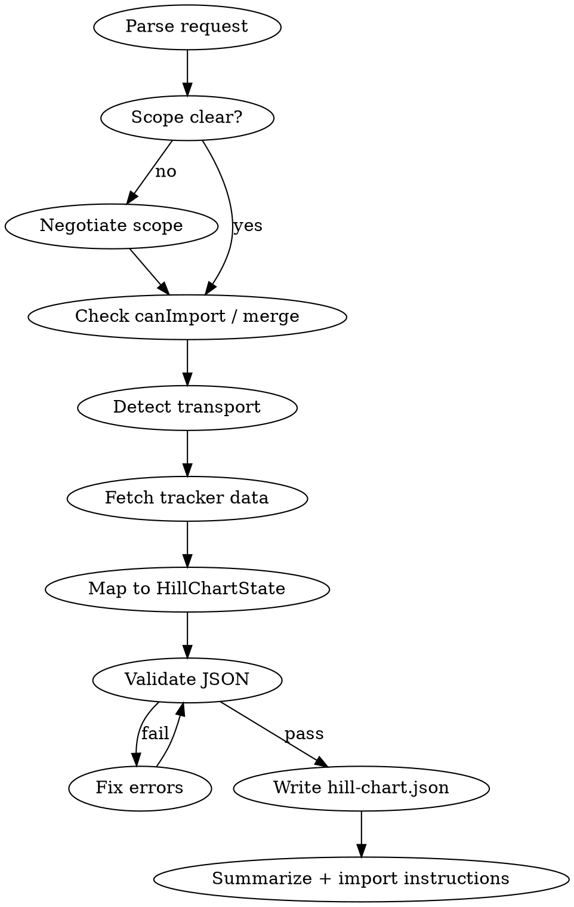

# Building werkwink State from Trackers

## Overview

Read-only pull from project-management tools → validate → write `hill-chart.json`
for werkwink's Import button. **One-way flow:** tracker → JSON → app. Never write
back to the tracker or to `localStorage`.

**Core principle:** Confirm scope with the user when anything is ambiguous; probe
transports silently; validate before delivery.

## When to Use

- User wants tracker items (epic, project, board, issues) on the hill chart
- User provides JQL, Linear filters, issue IDs, URLs, or natural-language scope
- User has an exported `hill-chart.json` to merge new items into

**When NOT to use:** Dragging dots, daily ritual, forces editing in-app — those
are werkwink UI, not this skill.

## Workflow

### 1. Negotiate scope

**REQUIRED:** Read `knowledge/scope-negotiation.md` when the request leaves any of
these open:

- Which parent items → projects (one epic vs many)
- Which children → tasks (all, open-only, selected IDs, substasks)
- Flat trackers (Trello lists, ungrouped issues) → how to partition

If the user was specific ("ENG-42 and all its child issues"), confirm only edge
cases (nested sub-issues depth, status filter). If vague, ask before fetching.

### 2. Check import mode

| Situation | Action |
|-----------|--------|
| Fresh / demo / empty chart | Produce full replacement JSON |
| User supplied existing export | **Merge** per `knowledge/merge-with-existing.md` |
| Chart has real data, no export | Tell user: Export → skill → Clean → Import |

`canImport` = `demo === true` OR `projects.length === 0`.

### 3. Detect transport

**REQUIRED:** Follow `knowledge/detect-transport.md`. Probe in order: MCP → CLI →
REST → manual paste. Announce which transport succeeded.

### 4. Fetch & map

**REQUIRED:** Follow `knowledge/mapping.md`. Uniform two-level shape:

- Tracker parent → `Project`
- Tracker child → `Task`
- Assignee → primary up force (`label: "Owner"`, `isPrimary: true`)

Per-tracker fetch notes: `knowledge/trackers/*.md`.

### 5. Validate & deliver

**REQUIRED:** Follow `knowledge/validate-output.md`. Run validation before writing
the file. Fix all errors; do not hand off invalid JSON.

Write `hill-chart.json` to workspace root (or user-specified path). Summarize:
projects/tasks added, transport used, scope applied. Link import steps (overview
Import button or drag-drop).

## Quick Reference

| Tracker parent | werkwink | Tracker child | werkwink |
|----------------|----------|---------------|----------|
| Epic, initiative, milestone | `Project` | Story, issue, card | `Task` |
| Project (Linear) | `Project` | Sub-issue | `Task` (if user includes) |
| Board list | `Project` (if user agrees) | Card | `Task` |

| New item defaults | Value |
|-------------------|-------|
| `position` | `0` |
| `snapshots` | `[]` |
| `lastMovedAt` | now (ISO) |
| Forces | Owner only from assignee |
| `demo` | omit or `false` |
| `version` | `1` |

## Red Flags — STOP

| Rationalization | Reality |
|-----------------|---------|
| "Import validates anyway" | Pre-validate; user shouldn't debug in UI |
| "User was specific, skip scope" | Specific ≠ complete; confirm depth, status, merge |
| "I'll write to localStorage" | Use file import only |
| "Fetch blockers from tracker" | v1: Owner force only; user adds forces in app |
| "Skip MCP schema check" | Read tool descriptors before every MCP call |
| "JSON looks like the demo" | Run validator; shape ≠ valid |

## Common Mistakes

- **Duplicate ids** — prefix with tracker slug (`proj_eng_42`, `task_eng_108`)
- **Missing primary up** — every project and task needs exactly one active
  `isPrimary: true` up force
- **Invalid color** — use `PALETTE_ORDER` from werkwink (`terracotta` first, then
  round-robin)
- **Writing back to tracker** — never; read-only pull
- **Skipping transport announcement** — user needs it for troubleshooting auth

## Supporting Files

| File | Purpose |
|------|---------|
| `knowledge/scope-negotiation.md` | When and how to ask about epic/task scope |
| `knowledge/detect-transport.md` | MCP → CLI → REST → paste probe order |
| `knowledge/mapping.md` | HillChartState field mapping |
| `knowledge/validate-output.md` | Validation before write |
| `knowledge/merge-with-existing.md` | Merge into exported state |
| `knowledge/trackers/*.md` | Per-tracker MCP/CLI/query notes |

**Schema source of truth:** `src/schema/types.ts`, `src/schema/validate.ts`, and
`fixtures/hill-chart-import-demo.json` in the werkwink repo.
