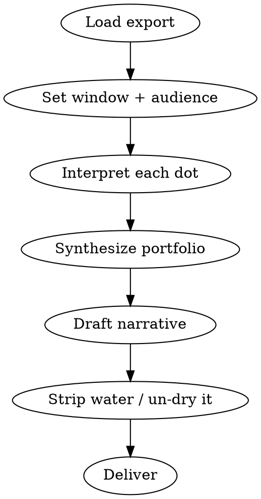

# Reporting werkwink Progress

## Overview

Read an exported `hill-chart.json` → interpret the hill (positions, trail,
forces, notes) → write a short narrative report a human actually wants to read.

**One-way flow:** export → skill → report. Read-only. Never modify the export,
the tracker, or `localStorage`.

**Core principle:** Report the *meaning*, not the measurements. The hill encodes
a story — direction, current state, projection. Tell that story in plain English.
Numbers are evidence you reach for occasionally, never the point.

> A report that says "Project X moved from 50 to 70" has failed. It should say
> "Project X is past the hard part — the approach is settled and the team is now
> building."

## When to Use

- User runs a recurring update (weekly or more often) off a werkwink export
- User pastes or points to a `hill-chart.json` and wants a status/standup/stakeholder report
- User asks "where are we", "what changed", "what's at risk", "what's next"

**When NOT to use:** Importing tracker data (that's `building-werkwink-state`),
or anything that edits the chart — that's the werkwink UI.

## Workflow

### 1. Load the export

Take the JSON from a file path or pasted text. It is a `HillChartState`
(`version`, `exportedAt`, `demo`, `projects[]`). If `demo: true`, say so — it's
sample data, not real work. Schema source of truth: `src/schema/types.ts`.

### 2. Set window and audience

Two questions decide the whole report. Infer when you safely can; ask only if it
changes the output materially.

- **Window** — what period to report on. Default to the last 7 days (user runs
  this weekly). Use snapshot dates to bound it. "Since last report" → since the
  previous distinct snapshot cluster.
- **Audience** — team standup, manager, or exec/stakeholder. Changes length and
  altitude, not honesty. See `knowledge/report-structure.md`.

### 3. Interpret each dot

**REQUIRED:** Follow `knowledge/interpreting-state.md`. For every project (and
notable task) translate position + trail + forces + notes + staleness into:
direction (where it's heading), current state (where it is, what's in the way),
and the human "why" from the notes.

### 4. Synthesize the portfolio

Step back. What's the one-line story across everything? Where is momentum, where
is risk, what needs a decision? Most dots are not interesting every week — lead
with the few that are.

### 5. Draft, then de-water

**REQUIRED:** Structure per `knowledge/report-structure.md`; voice per
`knowledge/voice-and-style.md`. Write the narrative, then ruthlessly cut filler
and rewrite any dry "moved from N to M" lines into meaning.

### 6. Deliver

Output the report as Markdown in chat. Offer to save it (e.g.
`reports/YYYY-MM-DD-werkwink.md`) only if the user wants a file. Keep it tight —
a weekly update is a short read, not a document.

## The hill in one table

| Region | Position | Means |
|--------|----------|-------|
| Uphill | 0–49 | Figuring it out — unknowns, shaping, de-risking |
| Peak | 50 | "We know how" — approach is settled |
| Downhill | 51–99 | Executing known work — building toward done |
| Done | 100 | Shipped (99 = project waiting on its last tasks) |
| Snap-back | dropped to 45 | A blocker forced a downhill item back to rethink |

## Red Flags — STOP

| Rationalization | Reality |
|-----------------|---------|
| "I'll list each position change" | That's a changelog, not a report — say what it means |
| "More numbers = more rigor" | Numbers are seasoning; meaning is the meal |
| "Notes are just metadata" | Notes are the between-the-lines story — mine them |
| "Thin data, I'll fill gaps" | Don't fabricate momentum; say it's early/quiet and stop |
| "Uphill, so I'll give an ETA" | Uphill ETAs are guesses — that's the point of the hill |
| "Sounds nicer with buzzwords" | Plain words land; corporate filler repels readers |

## Common Mistakes

- **Metric dumps** — `50→70`, tables of positions. Translate or drop.
- **Reporting every dot** — surface the few that moved or are stuck; roll up the rest.
- **False precision** — inventing dates/percentages the data doesn't support.
- **Ignoring snap-backs** — a drop to 45 is a story (hit a wall), not noise.
- **Dry and lifeless** — correct but boring; add the human "why" from notes.
- **Purple and padded** — the opposite failure; no water, no adjectives for their own sake.

## Supporting Files

| File | Purpose |
|------|---------|
| `knowledge/interpreting-state.md` | Turn position/trail/forces/notes/staleness into meaning |
| `knowledge/report-structure.md` | Sections, window, audience variants |
| `knowledge/voice-and-style.md` | Plain-English voice; before/after rewrites |

**Schema & semantics source of truth:** `src/schema/types.ts`,
`src/domain/forceRules.ts` (peak/blocker rules), `src/domain/staleness.ts`,
`src/domain/snapshots.ts`, and `docs/domain-vocabulary.md` in the werkwink repo.
